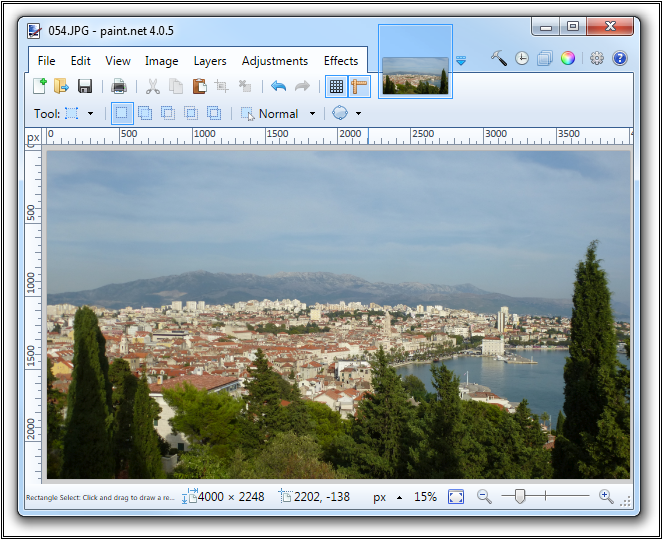
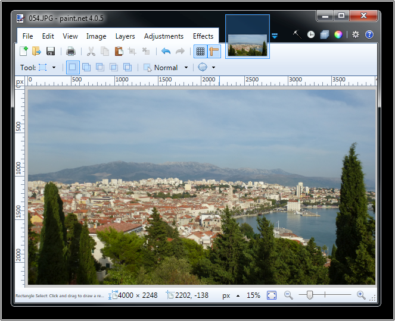
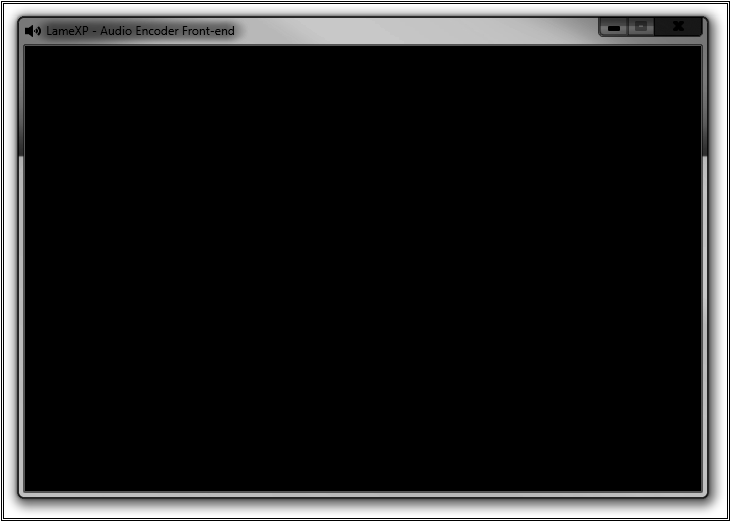
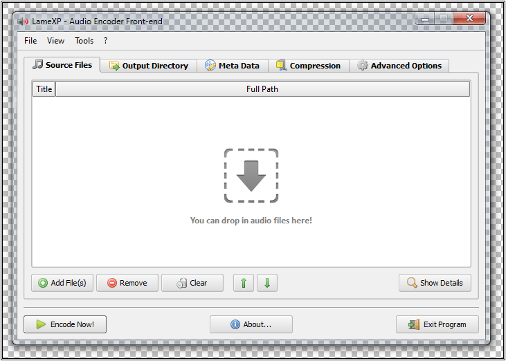

# Alpha Tool #

**Alpha Tool &ndash; compute alpha-channel from diff values**  
**Copyright (C) 2015 LoRd_MuldeR <<MuldeR2@GMX.de>>. Some Rights Reserved.**

	This program is free software: you can redistribute it and/or modify
	it under the terms of the GNU General Public License <http://www.gnu.org/>.
	Note that this program is distributed with ABSOLUTELY NO WARRANTY.

## Example ##

As a picture is worth a thousand words:

*Input File #1:*

*Input File #2:*

*Difference Map:*

*Final Result:*

&nbsp;  
&nbsp;  

e.o.f.
